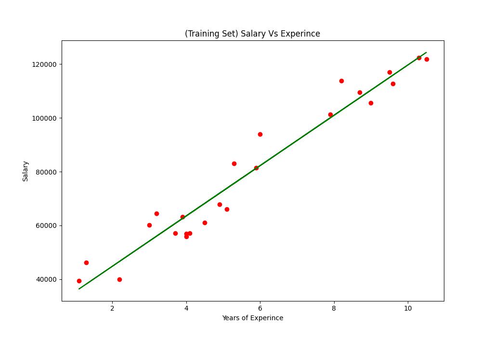
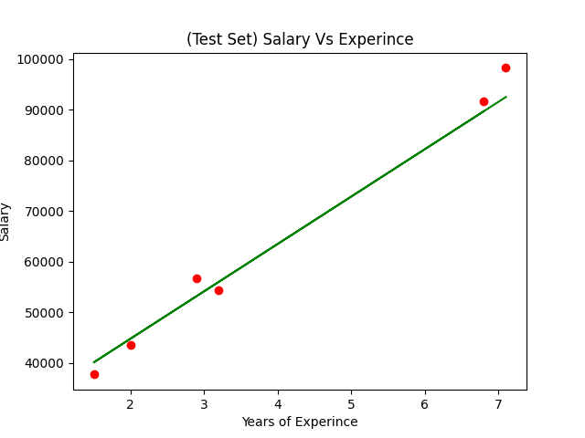
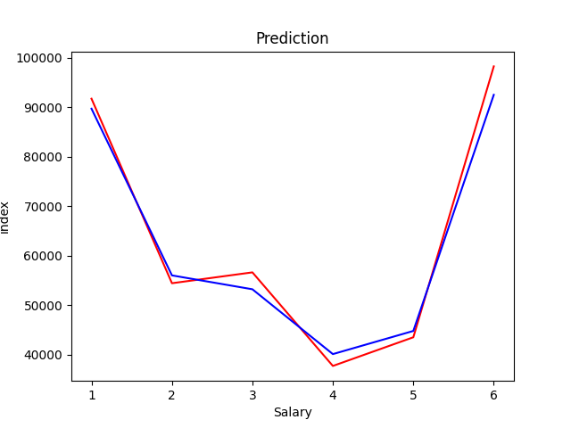

# Salary vs Experience Linear Regression

This repository contains Python code to perform linear regression on a dataset of salary vs experience. The dataset is loaded from a CSV file and then split into training and testing sets. A linear regression model is trained on the training set and evaluated on the testing set.

## Installation

To run the code, you need to have Python installed. Additionally, you need to have the following libraries installed:

	- pandas
	- numpy
	- seaborn
	- matplotlib
	- scikit-learn

You can install these libraries using pip:

## Description

The salary_vs_experience_regression.py script performs the following steps:

	- Load the dataset from Salary_Data.csv.
	- Split the data into features (years of experience) and target (salary).
	- Split the data into training and testing sets (80% training, 20% testing).
	- Train a linear regression model on the training data.
	- Evaluate the model on the testing data.
	- Plot the regression line on both training and testing sets.
	- Plot the comparison between actual and predicted salaries.
	- Print mean squared error and R-squared score.

## Output

The output includes several plots and performance metrics:

	- Training Set - Salary vs Experience
	

	- Testing Set - Salary vs Experience
	

	- Actual vs Predicted Salaries
	
